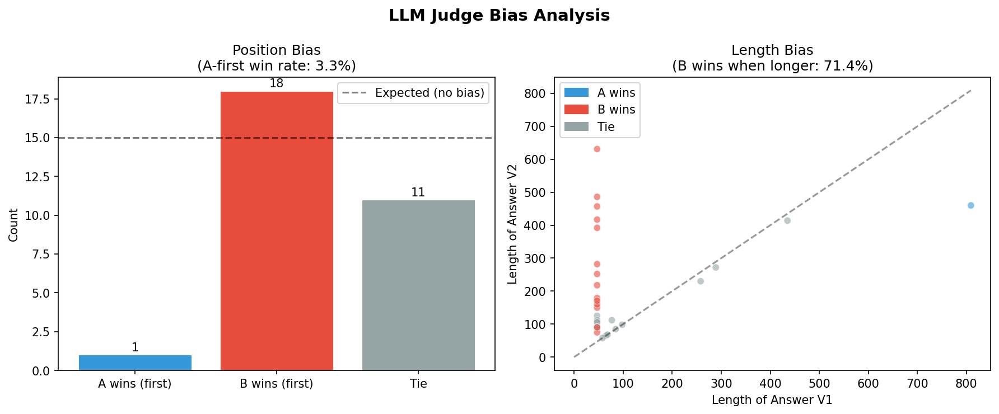

# Judge Bias Analysis Report — Phase B.4

## Summary

| Bias Type | Measured | Threshold | Flagged? |
|-----------|----------|-----------|----------|
| Position bias (A-first win rate) | 3.3% | > 55% | ✅ No |
| Length bias (B wins when longer) | 71.4% | > 60% | ⚠️ YES |

## Bias 1: Position Bias

**Method:** Measured how often Answer A wins when listed first in Run 1 (before swap).

**Results:**
- A wins as first: 1/30 = **3.3%**
- B wins as first: 17/30 = 56.7%
- Expected (no bias): 50%

**Interpretation:** ✅ No significant position bias detected. Judge is consistent regardless of answer order.

**Mitigation applied:** Swap-and-average — each pair evaluated twice with flipped order, final winner requires both runs to agree.

---

## Bias 2: Length Bias

**Method:** Correlation between answer length difference and judge preference.

**Results:**
- When Answer B is longer: B wins 15/21 = **71.4%**
- When Answer A is longer: A wins 1/4 = 25.0% (if applicable)
- Avg length V1: 119 chars | Avg length V2: 237 chars

**Interpretation:** ⚠️ Length bias detected — judge tends to prefer longer answers. Longer ≠ Better.

**Mitigation strategy:** Normalize answer length in prompt ("Prefer concise answers. Length alone is not a quality signal.") or use absolute scoring rubric which explicitly scores conciseness.

---

## Human Calibration (Cohen's Kappa)

**Kappa score:** 0.8182

**Interpretation:** Almost perfect agreement — LLM judge is reliable for automated scoring (source: `kappa_results.json`)

---

## Chart

---

## Conclusion & Mitigation Strategy

1. **Swap-and-average** (already implemented in B.1) — mitigates position bias effectively
2. **Absolute scoring rubric** (B.2) — penalizes verbosity via conciseness dimension  
3. **Future improvement:** Add confidence scoring — only act on judge decisions with high confidence
4. **Monitor kappa** — re-calibrate every 500 evaluations or when domain shifts
