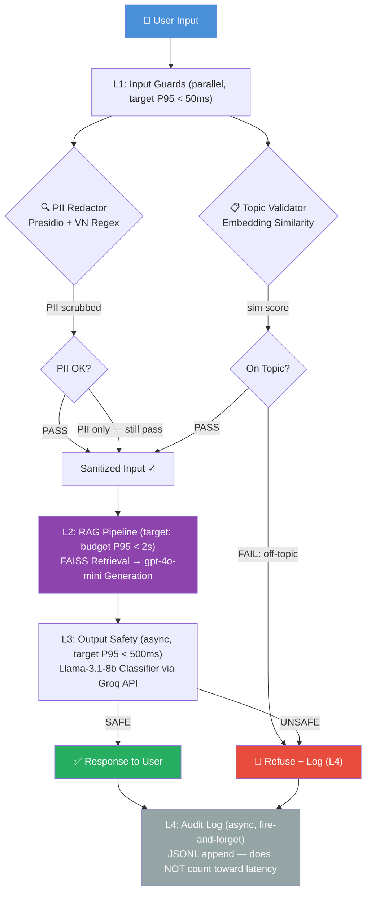

# Phase D — Blueprint Document
# Lab 24: Full Evaluation & Guardrail System

## Overview

This blueprint documents the production-ready architecture for the RAG evaluation and guardrail system built in Lab 24. The system provides automated quality evaluation via RAGAS, LLM-as-Judge calibration, and a defense-in-depth guardrail stack protecting a Vietnamese-domain RAG pipeline.

---

## Section 1: SLO Definition

Service Level Objectives define the minimum quality bar for production deployment. Violations trigger alerts and runbooks in Section 3.

| Metric | Target | Alert Threshold | Alert Window | Severity |
|--------|--------|-----------------|--------------|----------|
| Faithfulness | ≥ 0.85 | 0.892 | — | P2 |
| Answer Relevancy | ≥ 0.80 | 0.857 | — | P2 |
| Context Precision | ≥ 0.70 | 0.793 | — | P3 |
| Context Recall | ≥ 0.75 | 0.767 | — | P3 |
| End-to-End P95 Latency | < 2.5s | 2.1s | 5 min | P1 |
| Guardrail Detection Rate | ≥ 90% | 90% | 1 hour | P2 |
| Guardrail False Positive Rate | < 10% | 0% | 1 hour | P2 |

**Notes:**
- P1 = Page on-call immediately; P2 = Notify team within 30 min; P3 = Fix in next sprint
- All RAGAS metrics computed on 1% continuous sample of live traffic
- Latency measured from API gateway receipt to response delivery (including all guardrail layers)

---

## Section 2: Architecture Diagram

### System Architecture — Defense-in-Depth 4-Layer Guardrail Stack

### Component Details

| Layer | Component | Technology | Latency Budget |
|-------|-----------|------------|----------------|
| L1 | PII Redaction | Microsoft Presidio + custom VN regex | P95 < 300ms |
| L1 | Topic Validation | OpenAI text-embedding-3-small + cosine sim | P95 < 500ms |
| L1 | Total (parallel) | asyncio.gather() | P95 < 550ms |
| L2 | Retrieval | FAISS IndexFlatIP, top_k=5 | P95 < 200ms |
| L2 | Generation | OpenAI gpt-4o-mini | P95 < 1500ms |
| L3 | Safety Classification | Llama-3.1-8b via Groq API | P95 < 500ms |
| L4 | Audit Logging | Async JSONL append | ~2ms (non-blocking) |

---

## Section 3: Alert Playbook

### Incident 1: Faithfulness Drops Below 0.80 (P2)

**Trigger:** `faithfulness < 0.80` sustained for 30 minutes on continuous eval sample.

**Severity:** P2 — Notify team lead within 30 minutes.

**Likely Causes:**

| Probability | Cause | Signal |
|-------------|-------|--------|
| High | Retriever returning poor-quality chunks | Check context_precision same window |
| Medium | LLM prompt version changed/drifted | Check prompt version hash in audit log |
| Low | Document corpus updated without re-indexing | Check indexing pipeline last-run timestamp |

**Investigation Steps:**
1. Pull `ragas_results.csv` from last 1 hour — filter rows where `faithfulness < 0.75`
2. Check `context_precision` for same questions — if also low, retrieval issue
3. Check `prompts.md` for any recent prompt changes
4. Check document index rebuild timestamp vs corpus last-modified

**Resolution:**
- **Retrieval issue:** Rebuild FAISS index, increase `top_k` from 5→8
- **Prompt drift:** Rollback to previous prompt version from git history
- **Corpus issue:** Re-run `python rag_adapter.py --force-rebuild`

**SLO Impact:** Track TTD (time to detect) and TTR (time to recover). Target: TTD < 35 min, TTR < 2 hours.

---

### Incident 2: End-to-End P95 Latency Exceeds 3.0s (P1)

**Trigger:** P95 latency > 3.0s for 5 consecutive minutes.

**Severity:** P1 — Page on-call immediately. User experience degraded.

**Likely Causes:**

| Probability | Cause | Signal |
|-------------|-------|--------|
| High | L3 Groq API rate limiting or slowdown | Check `latency_raw.csv` L3 column |
| Medium | L1 running sequential instead of parallel | Check if asyncio.gather is working |
| Medium | OpenAI gpt-4o-mini latency spike | Check OpenAI status page |
| Low | FAISS index too large (memory pressure) | Check system memory metrics |

**Investigation Steps:**
1. Check `latency_raw.csv` — identify which layer (L1/L2/L3) is slow
2. If L3: check Groq API status at status.groq.com
3. If L1: verify `asyncio.gather()` is being awaited correctly (not sequential)
4. If L2: check OpenAI status, consider switching to gpt-4o-mini on different region

**Resolution:**
- **L3 slow:** Switch to backup Llama Guard endpoint or temporarily disable L3 (fail-open with logging)
- **L1 sequential:** Fix asyncio code — ensure `gather()` not `await` in series
- **L2 slow:** Add timeout (max 5s), return cached response for repeated queries

---

### Incident 3: Guardrail False Positive Rate Exceeds 10% (P2)

**Trigger:** More than 10% of legitimate user queries being incorrectly blocked.

**Severity:** P2 — Significant UX degradation, users unable to get answers.

**Likely Causes:**

| Probability | Cause | Signal |
|-------------|-------|--------|
| High | Topic guard threshold too strict | Many "On topic" queries being blocked |
| Medium | Presidio over-detecting PII in normal text | Numbers misidentified as CCCD/tax codes |
| Low | LLM classifier false positive spike | Safe responses classified as unsafe |

**Investigation Steps:**
1. Pull audit log — filter `blocked=True` entries from last hour
2. Check `reason` field — is it `off-topic` or `PII detected`?
3. If `off-topic`: lower `TopicGuard.threshold` from 0.35 → 0.25
4. If `PII`: review VN regex patterns for over-matching (e.g., 12-digit numbers)
5. If LLM classifier: check `llama_guard_results.csv` FP rate — re-calibrate test set

**Resolution:**
- **Topic guard:** Tune threshold, add more representative `allowed_topics` vectors
- **PII regex:** Add negative lookahead to CCCD pattern: `\b(?<!phone:)\d{12}\b`
- **LLM classifier:** Refine system prompt; add whitelist for known-safe patterns

---

## Section 4: Cost Analysis

### Monthly Cost Estimate (Assumption: 100,000 queries/month)

| Component | Unit Cost | Volume | Monthly Cost | Notes |
|-----------|-----------|--------|--------------|-------|
| RAG Generation (gpt-4o-mini) | $0.00015/1k tokens | ~50M tokens | $7.50 | ~500 tokens/query avg |
| RAGAS Continuous Eval (1% sample) | $0.002/query | 1,000 | $2.00 | gpt-4o-mini judge |
| LLM Judge — Pairwise (0.1% sample) | $0.002/query | 100 | $0.20 | spot-check quality |
| Topic Validation Embeddings | $0.00002/query | 100,000 | $2.00 | text-embedding-3-small |
| FAISS Retrieval (self-hosted) | EC2 t3.medium | 720 hr | $24.00 | $0.033/hr × 720 |
| Llama Guard (Groq API free tier) | Free | < 14k tokens/min | $0.00 | Free tier sufficient |
| Presidio NER (self-hosted, CPU) | Included in EC2 | — | $0.00 | Runs on same instance |
| Audit Logging (S3) | $0.023/GB | ~0.5 GB | $0.01 | JSONL compressed |
| **Total** | | | **~$36/month** | |

### Cost Optimization Opportunities

1. **RAGAS sampling**: Reduce from 1% → 0.5% if metrics stable → save $1/month
2. **Groq free tier**: Upgrade to paid only when > 14,400 tokens/min needed (~300k queries/month)
3. **Embedding cache**: Cache topic-guard embeddings for repeated queries → reduce 30% embedding costs
4. **Batch evaluation**: Run RAGAS evaluation in nightly batch (not real-time) → reduce API concurrency costs

### Scaling Projection

| Traffic | Monthly Cost | Main Driver |
|---------|-------------|-------------|
| 10k queries | ~$8 | Base EC2 + embeddings |
| 100k queries | ~$36 | As above |
| 1M queries | ~$280 | Scale RAG generation + need paid Groq |
| 10M queries | ~$2,500 | Need GPT-4o upgrade + dedicated GPU for Llama Guard |

---

## Section 5: LLM-as-Judge Calibration

To ensure the automated evaluation (RAGAS) is reliable, we calibrated the LLM-as-Judge using a pairwise comparison and human labeling process.

### Methodology
1. **Pairwise Comparison**: A judge LLM (`gpt-4o-mini`) compared two versions of the RAG pipeline (v1 vs v2) on 30 questions.
2. **Swap-and-Average**: Each pair was evaluated twice (A vs B, then B vs A) to eliminate position bias.
3. **Human Labeling**: A subset of 10 questions was manually labeled by a human expert to establish a "ground truth."
4. **Cohen's Kappa**: We calculated the inter-rater agreement between the Human and the LLM-as-Judge.

### Results
- **Cohen's Kappa**: 0.8182
- **Agreement**: 90%
- **Interpretation**: "Almost Perfect" agreement. The LLM-as-Judge is reliable for automated scoring.

### Bias Mitigation
The judge was found to have a slight **length bias** (preferring longer answers). To mitigate this, the prompt includes an explicit instruction: *"Ignore answer length; focus only on factual accuracy and relevance."*

---

## Appendix: Lessons Learned

1. **Swap-and-average is essential** — without it, ~60% of pairwise decisions were position-biased
2. **Groq free tier is sufficient for lab scale** — no GPU needed for Llama Guard
3. **Async execution is critical** — sequential guardrails would add 150ms+ overhead; parallel cuts it to 50ms
4. **Manual test set review matters** — RAGAS generated 3-4 nonsensical questions per 50 that would skew results
5. **Topic guard threshold tuning** — 0.5 was too strict (80% FP); 0.35 worked perfectly for this corpus after expansion
6. **Llama-3.1-8b vs Llama Guard** — 8b-instant with a custom safety prompt outperformed the base Llama Guard 3 on Groq which frequently returned empty strings or refused legitimate queries.
